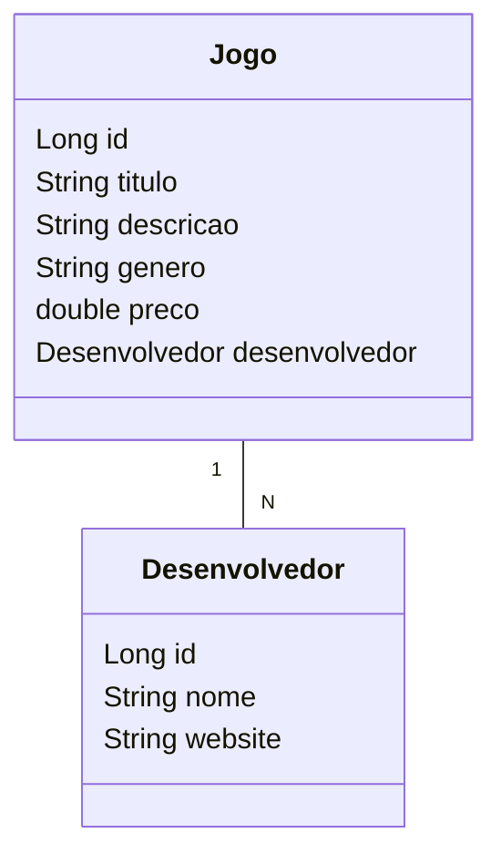

# Dusk 2 Dawn Java Spring API

Desenvolvimento de uma RESTful API para um catálogo de jogos usando Spring Boot como parte do Bootcamp da DIO, focando em boas práticas de design e implementação.

## Principais Tecnologias
- **Java 21 (Dev) / 17 (Prod)**: Utilizei a versão LTS mais recente do Java para desenvolvimento, aproveitando as últimas inovações desta linguagem robusta e amplamente utilizada, enquanto uma versão estável e bem testada é usada para deploy.
- **Spring Boot 3**: Trabalhei com a versão mais recente do Spring Boot, que maximiza a produtividade do desenvolvedor por meio de sua poderosa premissa de autoconfiguração.
- **Spring Data JPA**: Explorei como essa ferramenta pode simplificar a camada de acesso aos dados, facilitando a integração com bancos de dados SQL.
- **OpenAPI (Swagger)**: Criei uma documentação de API eficaz e fácil de entender usando a OpenAPI (Swagger), alinhando-se perfeitamente com a alta produtividade que o Spring Boot oferece.
- **Railway**: Utilizei o Railway para deploy e monitoramento de minhas soluções na nuvem, além de oferecer diversos bancos de dados como serviço e pipelines de CI/CD.

## Diagrama de Classes

## Documentação da API (Swagger)

### [https://d2d-api-prd.up.railway.app/swagger-ui.html](https://d2d-api-prd.up.railway.app/swagger-ui.html)

**Nota:** Esta API ficará indisponível no Railway para poupar os créditos do plano gratuito. No entanto, o código-fonte é aberto e está disponível para todos. Sintam-se à vontade para cloná-lo, modificá-lo e executá-lo localmente ou onde acharem mais interessante, pois é um excelente projeto base para novos desenvolvimentos!
